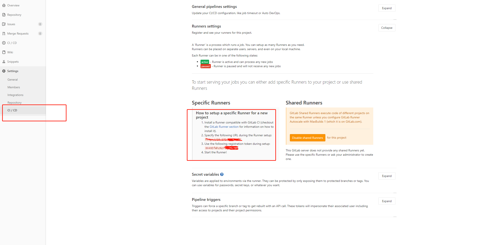
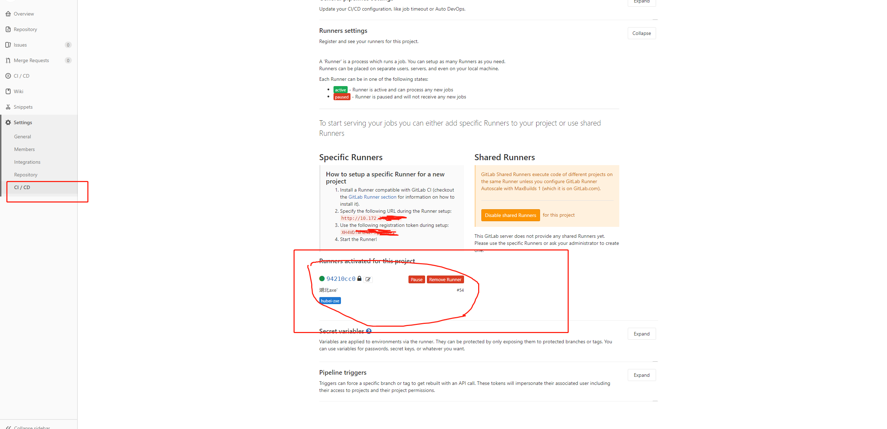

## GitLab+Docker 快速搭建 CI/CD 自动化部署(扫盲篇)

> 这里不深入讨论什么是 CI/CD, 简单而言就是工程的持续集成，持续交付;个人理解就是让项目代码自动打包，测试，部署，快速交付部署。对于开发来说就免去了繁琐的手动打包代码，部署的工作

#### 目标

**向 Gitlab 仓库推送代码, 自动打包并且部署**

```
简单的说，就是在本地更改代码—>git push推送到代码托管—>⾃动安装依赖，打包测试部署等（开发环境⼀般
⾃动，⽣产环境⼀般是需要⼿动点击按钮上线）
```

再想想上面的流程,我们提交代码, 由谁执行打包部署这一套流程呢, 答案是`gitlab-ci`.

> GitLab-CI 就是一套配合 GitLab 使用的持续集成系统（当然，还有其它的持续集成系统，同样可以配合 GitLab 使用，比如 Jenkins）。而且 GitLab8.0 以后的版本是默认集成了 GitLab-CI 并且默认启用的。

除了`gitlab-ci`, 还需要配合`gitlab-runner`一起工作才行

> gitlab-runner 是配合 gitlab ci/cd 实现自动化部署的执行者，实现的功能和 Jenkins 类似，可以通过编写对应的.gitlab-ci.yml 执行自动发布的 job 脚本。一般利用这个特性我们可以实现自动化部署方案。

### Gitlab-Runner

#### 安装

`gitlab-ci`已经默认集成, 所以现在最主要的是安装`gitlab-runner`,因为是 windows 机器,为了方便用`docker`安装`gitlab-runner`(linux本机安装,可自行查询, 安装跑起来就行了)

第一步,拉取`gitlab-runner`

```bash
docker pull gitlab/gitlab-runner
```

第二步,创建并启动`gitlab-runner`容器

```bash
docker run -itd --name gitlab-runner --restart always gitlab/gitlab-runner:latest
```
#### 注册

> 注册gitlab-runner 的主要目的是让runner关联gitlab仓库中的项目, 这样就可以让runner知道去执行那个项目

首先进入gitlab仓库, 选择一个项目,如下图



```bash
# 进入gitlab-runner终端
docker exec -it gitlab-runner bash
```

```bash
# 注册gitlab-runner命令
gitlab-runner register
```
会出现如下提示
```bash
root@9078a58e18b0:/# gitlab-runner register
Runtime platform                                    arch=amd64 os=linux pid=710 revision=bd40e3da version=14.9.1
Running in system-mode.

Enter the GitLab instance URL (for example, https://gitlab.com/):
```
在终端输入上图中URL,回车下一步

```bash
Enter the registration token:
```
在终端输入上图中registration token,回车下一步

这是最重要的两个步骤
后面的信息按照提示填写即可(runner 的描述,runner的tags,最后的`executor`选择`shell`即可)

最后你会在gitlab项目仓库小看到如下图的内容, 说明此项目的runner就配置成功了



#### 到这一步,已经成功了一半了

> 下面我们要做的是我们推送代码后, 具体怎么去执行,比如在打包前安装依赖, lint检查,打包后上传到服务器等等

### 创建文件.gitlab-ci.yml
> .gitlab-ci.yml文件就是描述打包过程的，告诉gitlab-runner怎么去打包我们的代码

在项目根目录里面创建一个.gitlab-ci.yml，编写代码如下:
```yml
stages:
  - build-with-deploy

variables:
  NPM_PROXY_REPO: https://registry.npm.taobao.org
  REPO_NAME: oecweb
  namespace: 'jiangsu'

Build-With-Deploy:
  image: node:alpine
  stage: build-with-deploy
  only:
    - master
  tags:
    - 'jiangsu'
  script:
    - echo "开始打包了"
    - node -v
    - npm -v
    - npm install --registry=${NPM_PROXY_REPO}
    - npm run pro
    - mv dist ${REPO_NAME}
    - DIST_NAME=${REPO_NAME}-$(date "+%Y%m%d").tar.gz
    - tar -zcf ${DIST_NAME} ${REPO_NAME}
  when: on_success
```
这个yml文件描述了,项目master分支推送代码后,执行打包任务,打包后对dist文件内容进行压缩处理

参数说明:
- stage:定义某个job的所在阶段
- image:指定一个基础Docker进行作为基础运行环境，比如:node,python,java
- tags:用于指定Runner，tags的取值范围是在该项目可惜可见的runner tags中，也就是前面我们gitlab-runner设置的那个tag
- only/except:知道当前任务条件
- variables:变量
- script: 运行的脚本
- when:实现在发生故障时仍能运行的作业

