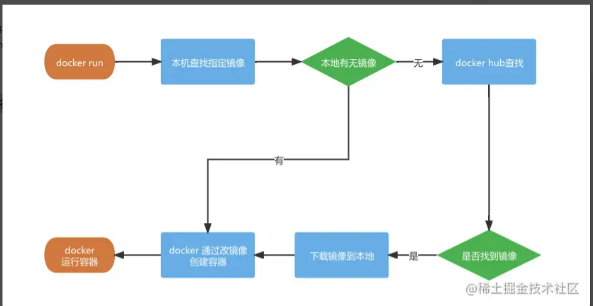

## Windows 安装

?>步骤一.[官网下载](https://www.docker.com/get-started)

?>步骤二，安装完成后，双击启动 Docker，控制台输入`docker -v`检查是否安装成功

### docker 基础

`docker` 分几个概念：镜像、容器、仓库

**镜像**：就是像是我们装机时候需要的系统盘或者系统镜像文件，这里它负责创建 docker 容器的，有很多官方现成的镜像：node、mysql、monogo、nginx 可以从远程仓库下载

**容器**：可以比拟成一个迷你的系统，例如一个只安装 mysql5.7 的 linux 最小系统，当然你喜欢也可以把 mysql、node 安装在同一个容器中，记住**，容器与容器，容器和主机都是互相隔离的**

**仓库**：仓库就像是 github 那样的，我们可以制作镜像然后 push 提交到云端的仓库，也可以从仓库 pull 下载镜像

### 实战：部署 vue2 和 vue3 项目

安装好`docker`后，我们现在来实战了，搓搓手

我们要让电脑同时运行`nodejs10`和`nodejs12`多个版本

##### 1 准备 vue2 、 vue3 项目

先跟着一起做，咱后面再解释

现在新建一个文件放我们的项目：命名 为 :`my-repository`

**安装 vue2+webpack 项目**

```bash
# 0 命令行进入到该文件夹的位置：
cd /你的电脑具体的文件路径/my-repository

# 1.现在安装vue-cli
npm install -g @vue/cli

# 2.查看vue-cli安装成功否
vue --version
#我这里是@vue/cli 4.5.15

# 3. 用vue-cli快速创建项目,安装选项我们如下
# > ❯ Default ([Vue 2] babel, eslint)
# > ❯ npm包管理
vue create my-app-vue2


```

**安装 vue3+vite 项目**

```
#先安装vite最新版
npm init vite@latest

# 创建vue3项目
npm init vite@latest my-app-vue3 --template vue

```

```js
//vite需要开启网络访问
//vite.config.js 开启host
export default defineConfig({
  plugins: [vue()],
+  server: {
+    host: '0.0.0.0',
+  },
});

```

```
#安装完成后我们的目录是这样的
my-repository
├── my-app-vue2
│   ├── public
│   └── src
│       ├── assets
│       └── components
└── my-app-vue3
    ├── public
    └── src
        ├── assets
        └── components
```

##### 2 创建运行 docker 容器

```bash
# 0 先进入我们刚才安装了vue项目的文件夹位置
cd my-repository

# 1 执行pwd可以获取当前文件夹在电脑的绝对目录
pwd
# /Users/eric/my-repository

# 2 运行创建docker容器1：承载 vue2+webpack+nodejs10
docker run -it -d --name myvue2 --privileged -p 8081:8080 -v  /Users/eric/my-repository/my-app-vue2:/app/vue node:10.16.2 /bin/bash -c "cd /app/vue && node -v && npm install && npm run serve"

# 3 运行创建docker容器2：承载 vue3+vite+nodejs12
docker run -it -d --name myvue3 --privileged -p 8080:3000 -v /Users/eric/my-repository/my-app-vue3:/app/vue node:12.22.6 /bin/bash -c "cd /app/vue && node -v && npm install && npm run dev"

#运行成功后 查看容器运行情况
docker ps -a

```

在终端输入`docker ps -a`, 查看是否运行,我们可以看到容器的启动状态、端口映射、容器名字

打开浏览器，我们访问**localhost:8080**和**localhost:8081**就可以访问了

如果出错可看下面第三点：运行如下命令查看原因

```bash
docker logs -f container_id/containe_name
```

上面那一坨`docker run xxxxx` 的代码到底是啥，现在我们就来捋顺

先换行来看 : shell 脚本太长的时候我们可以用 "\"把一行命令分成多行

```bash
docker run \
-it \
-d \
--name myvue2 \
--privileged \
-p 8081:8080 \
-v /Users/eric/my-repository/my-app-vue2:/app/vue \
node:10.16.2 \
/bin/bash -c "cd /app/vue2 && node -v && npm install && npm run serve"
```

这里我们使用 `docker run` 命令可以**下载镜像 ->通过镜像创建容器 ->启动运行容器**

参数解析：

| 参数                                                                   |                                                                                                                           描述                                                                                                                           |
| ---------------------------------------------------------------------- | :------------------------------------------------------------------------------------------------------------------------------------------------------------------------------------------------------------------------------------------------------: |
| -d                                                                     |                                                                                         以守护进程的方式让容器在后台运行，在这您之 前可能使用的是 pm2 来守护进程                                                                                         |
| -it                                                                    |                                                               这里是 -i 和 -t 的缩写 -i：告诉 Docker 容器保持标准输入流对容器开放,即使容器没有终端连接 告诉 Docker 为容器分配一个虚拟终端                                                                |
| --name myvue2                                                          |                                                                                        **将容器命名为 myvue2，这样访问和操作容 器等就不需要输入一大串的容器 ID**                                                                                         |
| --privileged                                                           |                                                                                                         让容器的用户在容器内能获取完全 root 权限                                                                                                         |
| --p 8081:8080                                                          | 将容器的 8080 端口映射到宿主机的 8081 端口上这样我们访问本机的 localhost:8081,就是访问到容器的 8080 端口因为容器都是独立运行互相隔离的，容器与容器各自的 8080 端口、容器跟主机各自的 8080 端口都不是一个东西，主机只有在这给端口做映射才能访问到容器端口 |
| -v /Users/eric/my-repository/my-app-vue2:/app/vue                      |          将主机的 my-app-vue2 目录(命令行这里只能写绝对路径哈)下的内容挂载到容器的目录/app/vue 内，如果容器的指定目录有文件/文件夹，将被清空挂载后，容器修改 /app/vue 目录的内容，也是在修改主机目录/Users/eric/my-repository/my-app-vue2 内容           |
| node:10.16.2                                                           |                                                                             这里是指定 nodejs，版本为 10.16.2 的镜像来创建容器,如果不指定版本，会默认下载当前镜像的最新版本                                                                              |
| /bin/bash -c "cd /app/vue2 && node -v && npm install && npm run serve" |                                          /bin/bash：是在让容器分配的虚拟终端以 bash 模式执行命令 -c ""cd /app/vue2 && node -v && npm install && npm run serve：只能执行一条 shell 命令，需要多个命令按需用&&、                                           |

##### **docker run 的运行示意图**



### 调试命令

**常用的调试命令**

```bash
# 运行后按ctrl + c 可退出
docker logs -f contianer_name/container_id
```

当然容器内正在进行编译或者发生错误甚至退出的时候，我们可用此命令查看终端输出的信息

运行成功后，查看`myvue` 容器的`npm run serve` 在终端上的实时输出信息

```bash
#查看docker container的终端输出信息
docker logs -f myvue2

```

```basg
# 打印出容器的端口映射、目录挂载、网络等等
docker inspect myvue2
```

### 常用操作命令

?> 常用的操作命令表一栏


### 镜像操作命令

```bash
# 搜索镜像
docker search [images_name:tag]

# 下载镜像（：指定版本）
docker pull [images_name:tag]

# 查看本地下载的镜像
docker images

# 自己构建镜像
# 根据dockerfile的路径或者url构建镜像
 docker build [OPTIONS] PATH|URL|-

# 查看镜像的构建历史
docker history [images_name]

# 删除镜像
# 需要先删除以此镜像为基础的容器
 docker rmi [images_name]

```

### 容器操作命令

```bash
# 查看运行中的容器
# 可以查看容器ID、基础镜像、容器名称、运行状态、端口映射等
docker ps

# 查看所有容器：包括停止的
docker ps -a

# 查看容器的信息
# 例如端口号的映射、目录挂载
docker inspect [images_name/images_id]

# 启动和停止容器
docker start/stop [container_name/container_id]

#  重启容器
#  使用场景实例：
#  在加入新的npm包依赖需要重新编译的时候使用重启运行编译
#  nginx容器的配置更新后需要重启生效
docker restart [container_name/container_id]

# docker commit :从容器创建一个新的镜像。
docker commit [OPTIONS] CONTAINER_ID [REPOSITORY[:TAG]]

OPTIONS说明：

  -a :提交的镜像作者；

  -c :使用Dockerfile指令来创建镜像；

  -m :提交时的说明文字；

 -p :在commit时，将容器暂停。


实例: 将容器a404c6c174a2 保存为新的镜像,并添加提交人信息和说明信息。

docker commit -a "rzx007" -m "my apache" a404c6c174a2  mymysql:v1 

# 进入容器
# ps:有些容器没有bash,需要改成/bin/sh，例如mysq、mongodb的
# 退出人容器输入exit 回车键
docker exec -it [container_name/container_id] /bin/bash

# 删除容器
# 在容器停止的状态才能删
docker rm [container_name/container_id]

# 容器主机文件拷
# 将容器文件拷贝到主机
docker cp [container_id/container_name] : [文件目录] [主机目录]

# 将主机的目录拷贝到容器
docker cp [主机目录] [container_id/container_name] : [文件目录]


```
### 任务 docker部署nginx，并配置好
[https://www.cnblogs.com/chuyi-/p/15201718.html](https://www.cnblogs.com/chuyi-/p/15201718.html)
### 进阶

如果没有合适的镜像，我们通常用 Dockerfile 来构建自定义镜像

发现没，上面的 docker run 只能创建启动一个 docker 容器，我们可以用 docker-compose 来一次启动多个容器，常用于单机下安装多个服务

慢点再来更新，大家有兴趣也可以先看到我用 docker 部署的[Jenkins 自动化部署 CI/CD 环境](https://juejin.cn/post/6867861517603438605) 里面也有 docker-compose 的使用
