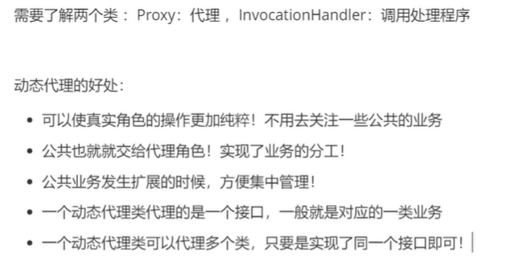

### 动态代理


```java

import java.lang.reflect.InvocationHandler;
import java.lang.reflect.Method;
import java.lang.reflect.Proxy;

//动态代理，通用模板
public class ProxyCommonInvocationHandler implements InvocationHandler {
    //    要被代理的接口
    private Object target;

    public void setTarget(Object target) {
        this.target = target;
    }

    // 生成得到的代理接口
    public Object getTarget() {
        return Proxy.newProxyInstance(this.getClass().getClassLoader(), target.getClass().getInterfaces(), this);
    }

    //    处理代理实例, 并返回结果, 代理逻辑写在这里
    @Override
    public Object invoke(Object proxy, Method method, Object[] args) throws Throwable {
//        System.out.println(method.getName());
        checkCount();
        return method.invoke(target, args);
    }

//    插入额外逻辑
    public void checkCount() {
        System.out.println("带看次数加1");
    }

    public static void main(String[] args) {

        Host host = new Host();     // 真是角色，或者说是要被代理的类

        ProxyCommonInvocationHandler proxyInvocationHandler = new ProxyCommonInvocationHandler(); // 实话代理类
        proxyInvocationHandler.setTarget(host); // 设置要被代理的类
        Rent proxy = (Rent) proxyInvocationHandler.getTarget();// 动态获取被代理的类
        proxy.rent();
        proxy.check();
    }
}

```