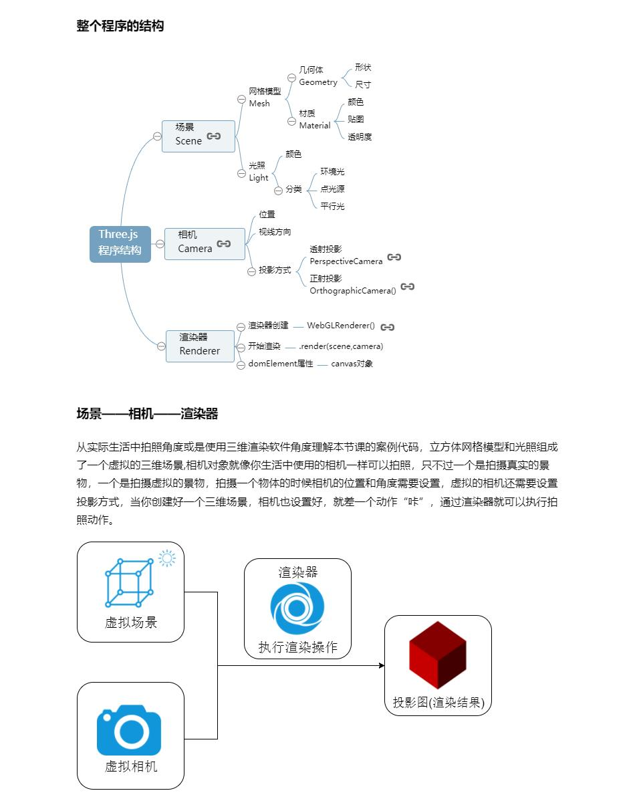

## THREEJS 快速入门

!> 相关资料
- [three官网](https://threejs.org/)
- [three中文教程](http://www.webgl3d.cn/Three.js/)

#### three 三大要素
1. 渲染器(renderer), 通过 `new THREE.WebGL1Renderer()`实例一个渲染器
2. 相机(camera)
3. 场景(sence)

!> 上图


#### 简单demo

```js
<!DOCTYPE html>
<html lang="en">

<head>
  <meta charset="UTF-8">
  <title>第一个three.js文件_WebGL三维场景</title>
  <style>
    body {
      margin: 0;
      overflow: hidden;
      /* 隐藏body窗口区域滚动条 */
    }
  </style>
  <!--引入three.js三维引擎-->
  <script src="http://www.yanhuangxueyuan.com/versions/threejsR92/build/three.js"></script>
  <!-- <script src="./three.js"></script> -->
  <!-- <script src="http://www.yanhuangxueyuan.com/threejs/build/three.js"></script> -->
</head>

<body>
  <script>
    /**
     * 创建场景对象Scene
     */
    var scene = new THREE.Scene();
    /**
     * 创建网格模型
     */
    // var geometry = new THREE.SphereGeometry(60, 40, 40); //创建一个球体几何对象
    var geometry = new THREE.BoxGeometry(100, 100, 100); //创建一个立方体几何对象Geometry
    var material = new THREE.MeshLambertMaterial({
      color: 0x0000ff
    }); //材质对象Material
    var mesh = new THREE.Mesh(geometry, material); //网格模型对象Mesh
    scene.add(mesh); //网格模型添加到场景中
    /**
     * 光源设置
     */
    //点光源
    var point = new THREE.PointLight(0xffffff);
    point.position.set(400, 200, 300); //点光源位置
    scene.add(point); //点光源添加到场景中
    //环境光
    var ambient = new THREE.AmbientLight(0x444444);
    scene.add(ambient);
    // console.log(scene)
    // console.log(scene.children)
    /**
     * 相机设置
     */
    var width = window.innerWidth; //窗口宽度
    var height = window.innerHeight; //窗口高度
    var k = width / height; //窗口宽高比
    var s = 200; //三维场景显示范围控制系数，系数越大，显示的范围越大
    //创建相机对象
    var camera = new THREE.OrthographicCamera(-s * k, s * k, s, -s, 1, 1000);
    camera.position.set(200, 300, 200); //设置相机位置
    camera.lookAt(scene.position); //设置相机方向(指向的场景对象)
    /**
     * 创建渲染器对象
     */
    var renderer = new THREE.WebGLRenderer();
    renderer.setSize(width, height);//设置渲染区域尺寸
    renderer.setClearColor(0xb9d3ff, 1); //设置背景颜色
    document.body.appendChild(renderer.domElement); //body元素中插入canvas对象
    //执行渲染操作   指定场景、相机作为参数
    renderer.render(scene, camera);
  </script>
</body>
</html>
```