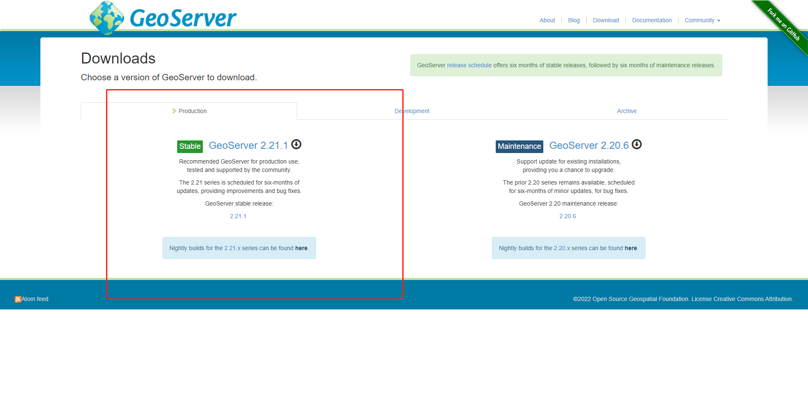
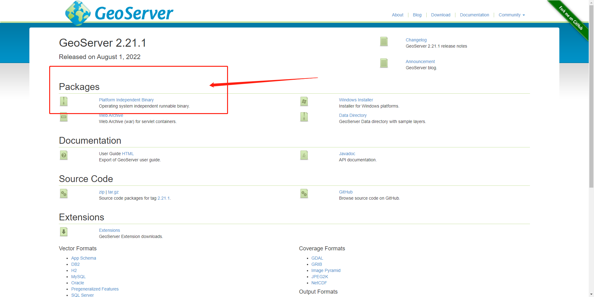
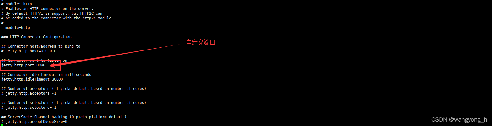

## GeoServer 简介、下载、配置启动、发布 shapefile 全流程(图文实践)

### 场景

### Geoserver 简介

GeoServer 是 OGC Web 服务器规范的 J2EE 实现，利用 GeoServer 可以方便地发布地图数据，允许用户对特征数据进行更新、删除、插入操作，通过 GeoServer 可以比较容易地在用户之间迅速共享空间地理信息。GeoServer 是开源软件。

GeoServer 是基于 Java 的软件服务器，允许用户查看和编辑地理空间数据。使用开放地理空间联盟（OGC）提出的开放标准，GeoServer 在地图创建和数据共享方面具有极大的灵活性。

GeoServer 允许您向世界显示您的空间信息。实施 Web 地图服务（WMS）标准，GeoServer 可以创建各种输出格式的地图。一个免费的地图库 OpenLayers 已集成到 GeoServer 中，从而使地图生成快速简便。GeoServer 基于 GeoTools（一种开放源 Java GIS 工具包）构建。

### Geoserver 官网

[http://geoserver.org/](http://geoserver.org/)

### 实现

### Geoserver 下载

进入官网，点击 Stable 下版本标签进入下载页面



然后选择二进制文件进行下载，也可以选择后面的 war 包下载部署到 Tomcat 中运行



选择 Binary 解压版下载，下载成功之后将其上传到 Linux 服务器上并解压

使用命令 `rz` 将下载的文件 `geoserver-2.21.1-bin.zip` 上传到指定目录 GeoServer 中

解压文件：`unzip geoserver-2.21.1-bin.zip `
> 建议的位置为`/usr/share/geoserver`

编辑`start.ini`文件修改端口号，这里修改为`7070`端口，默认是`8088`
命令：`vi start.ini`



打开服务器的对应7070端口

`firewall-cmd --add-port=7070/tcp --permanent`

重新加载防火墙

`firewall-cmd --reload`

查看防火墙开放端口

`firewall-cmd --zone=public --list-ports`

> 配置环境变量前确认是否安装java jdk，若已安装继续，[否则先安装jdk](https://blog.csdn.net/u013869554/article/details/122582107)

添加环境变量以保存GeoServer的位置
```bash
[root@test ~]# echo "export GEOSERVER_HOME=/usr/share/geoserver" >> /etc/profile

[root@test ~]# source /etc/profile

```
通过进入目录geoserver/bin，授予执行.sh的权限

命令：`chmod u+x *.sh`

后台执行启动的.sh脚本并保持一直运行

命令：`nohup ./startup.sh &`