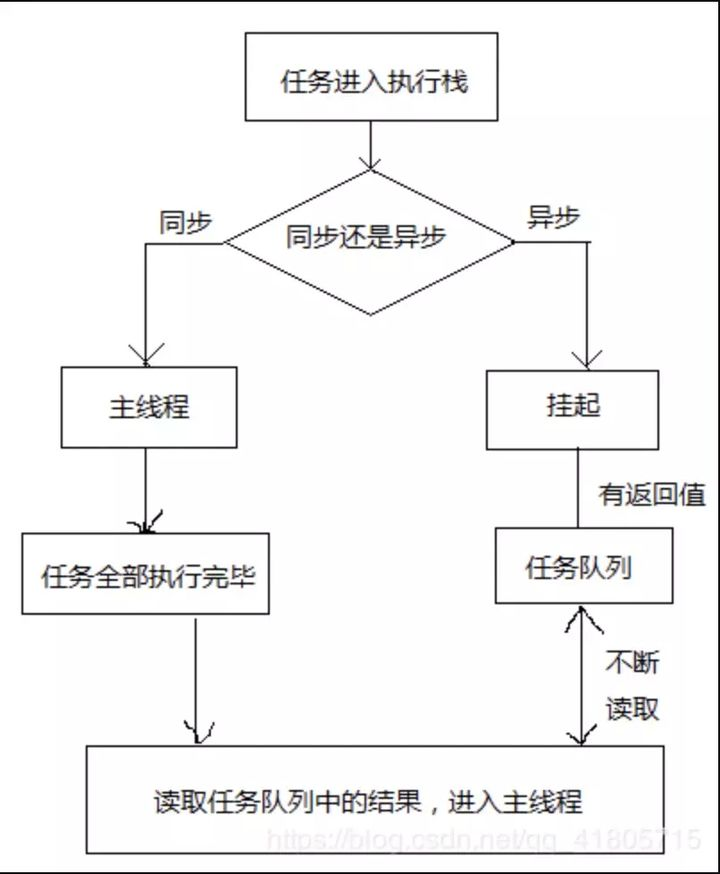
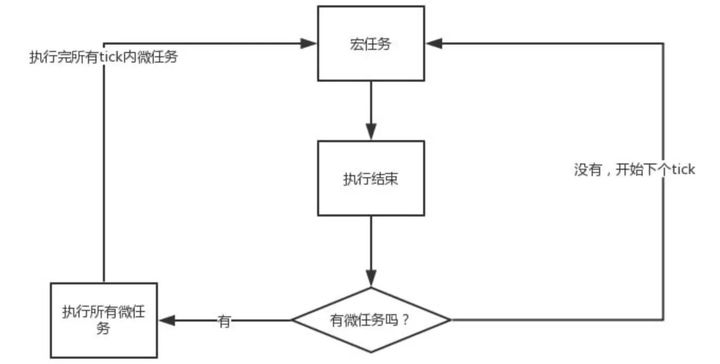
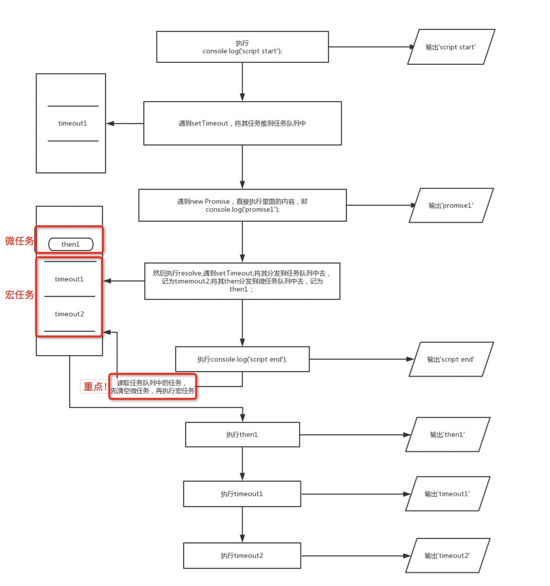

## js事件循环
> 众所周知，JavaScript 是一门单线程语言，虽然在 html5 中提出了 Web-Worker ，但这并未改变 JavaScript 是单线程这一核心,，可是浏览器又能很好的处理异步请求，那么到底是为什么呢？

#### 浏览器执行线程

>在解释事件循环之前首先先解释一下浏览器的执行线程：浏览器是多进程的，浏览器每一个 tab 标签都代表一个独立的进程，其中浏览器渲染进程（浏览器内核）属于浏览器多进程中的一种，主要负责页面渲染，脚本执行，事件处理等;其包含的线程有：GUI 渲染线程（负责渲染页面，解析 HTML，CSS 构成 DOM 树）、JS 引擎线程、事件触发线程、定时器触发线程、http 请求线程等主要线程

#### 关于执行中的线程：
>主线程：也就是 js 引擎执行的线程，这个线程只有一个，页面渲染、函数处理都在这个主线程上执行。工作线程：也称幕后线程，这个线程可能存在于浏览器或js引擎内，与主线程是分开的，处理文件读取、网络请求等异步事件。

#### 任务队列( Event Queue )

>所有的任务可以分为同步任务和异步任务，同步任务，顾名思义，就是立即执行的任务，同步任务一般会直接进入到主线程中执行；而异步任务，就是异步执行的任务，比如ajax网络请求，setTimeout 定时函数等都属于异步任务，异步任务会通过任务队列的机制(先进先出的机制)来进行协调。


**同步和异步任务分别进入不同的执行环境，同步的进入主线程，即主执行栈，异步的进入任务队列。主线程内的任务执行完毕为空，会去任务队列读取对应的任务，推入主线程执行。 上述过程的不断重复就是我们说的 Event Loop (事件循环)。**

在事件循环中，每进行一次循环操作称为tick，通过阅读规范可知，每一次 tick 的任务处理模型是比较复杂的，其关键的步骤可以总结如下：

1. 在此次 tick 中选择最先进入队列的任务( oldest task )，如果有则执行(一次)
2. 检查是否存在 Microtasks ，如果存在则不停地执行，直至清空Microtask Queue
3. 更新 render
4. 主线程重复执行上述步骤

可以用一张图来说明下流程：



?> 这里涉及到两个概念，宏任务和微任务，task分为两大类, 分别是 `Macro Task （宏任务）`和` Micro Task（微任务）`, 并且每个宏任务结束后, 都要清空所有的微任务,这里的 `Macro Task`也是我们常说的 task ，有些文章并没有对其做区分，后面文章中所提及的task皆看做宏任务( macro task)。

**宏任务主要包含：script( 整体代码)、setTimeout、setInterval、I/O、UI 交互事件、setImmediate(Node.js 环境)**

**微任务主要包含：Promise、MutaionObserver、process.nextTick(Node.js 环境)**

setTimeout/Promise 等API便是任务源，而进入任务队列的是由他们指定的具体执行任务。来自不同任务源的任务会进入到不同的任务队列。其中 setTimeout 与 setInterval 是同源的。

#### 举例
```js
console.log('script start');

setTimeout(function() {
  console.log('setTimeout');
}, 0);

Promise.resolve().then(function() {
  console.log('promise1');
}).then(function() {
  console.log('promise2');
});

console.log('script end');
```
- 整体 script 作为第一个宏任务进入主线程，遇到 console.log，输出
- 遇到 setTimeout，其回调函数被分发到宏任务 Event Queue 中
- 遇到 Promise，其 then函数被分到到微任务 Event Queue 中,记为 then1，之后又遇到了 then 函数，将其分到微任务 Event Queue 中，记为 then2
- 遇到 console.log，输出 script end

**至此，Event Queue 中存在三个任务：宏任务：setTimeout 微任务：then1、then2**

执行微任务，首先执行then1，输出 promise1, 然后执行 then2，输出 promise2，这样就清空了所有微任务
执行 setTimeout 任务，输出 setTimeout 至此，输出的顺序是：script start, script end, promise1, promise2, setTimeout

再来一个题目，来做个练习：
```js
console.log('script start');

setTimeout(function() {
  console.log('timeout1');
}, 10);

new Promise(resolve => {
    console.log('promise1');
    resolve();
    setTimeout(() => console.log('timeout2'), 10);
}).then(function() {
    console.log('then1')
})

console.log('script end');
```
首先，事件循环从宏任务 (macrotask) 队列开始，最初始，宏任务队列中，只有一个 scrip t(整体代码)任务；

当遇到任务源 (task source) 时，则会先分发任务到对应的任务队列中去。

所以，就和上面例子类似，首先遇到了console.log，输出 script start；

接着往下走，遇到 setTimeout 任务源，将其分发到任务队列中去，记为 timeout1；

接着遇到 promise，new promise 中的代码立即执行，输出 promise1, 然后执行 resolve ,遇到 setTimeout ,将其分发到任务队列中去，记为 timemout2, 将其 then 分发到微任务队列中去，记为 then1；

接着遇到 console.log 代码，直接输出 script end 接着检查微任务队列，发现有个 then1 微任务，执行，输出then1 再检查微任务队列，发现已经清空，则开始检查宏任务队列，执行 timeout1,输出 timeout1；

接着执行 timeout2，输出 timeout2 至此，所有的都队列都已清空，执行完毕。

其输出的顺序依次是：script start, promise1, script end, then1, timeout1, timeout2

一图胜千言：




?> 再来一个

```js
async function async1() {
    console.log('2');
    await async2();
    console.log('6');
}
async function async2() {
	console.log('3');
}

console.log('1');

setTimeout(function() {
    console.log('8');
}, 0)

async1();

new Promise(function(resolve) {
    console.log('4');
    resolve();
}).then(function() {
    console.log('7');
});
console.log('5');
```
由于因为async await 本身就是promise+generator的语法糖。所以await后面的代码是microtask。所以对于本题中的
```js
async function async1() {
	console.log('async1 start');
	await async2();
	console.log('async1 end');
}
```
等价于
```js
async function async1() {
	console.log('async1 start');
	Promise.resolve(async2()).then(() => {
                console.log('async1 end');
        })
}
```
结果
```
1,2,3,4,5,6,7,8
```
#### 总结

从规范来看，microtask 优先于 task（ macro task） 执行，所以如果有需要优先执行的逻辑，放入microtask 队列会比 task（ macro task） 更早的被执行。
因为浏览器设计的原因，JS 线程和渲染线程互斥，所以 JS 线程被设计成了单线程。

因为单线程执行一些操作（如网络请求）时有堵塞的问题，所有产生了异步。

因为有了异步，所以产生了异步编程，从而有了回调函数。

因为回调函数写多了会产生回调地狱，所有又有了解决回调地狱的 Promise 写法

自 ES7 标准后有了比 Promise 更加优雅的写法 ———— async/await 写法，也是异步编程的最终解决方法。

因为 JS 的代码分为同步和异步代码，同步代码的执行顺序不必多说，自上而下的执行。

但是如果有多个异步的代码，他的执行顺序又是怎么的呢？？

为了解决多个异步代码的执行顺序问了，有了事件循环（EventLoop），将异步任务区分为宏任务、微任务，依据规则依次执行。

**最后的最后，记住，JavaScript 是一门单线程语言，异步操作都是放到事件循环队列里面，等待主执行栈来执行的，并没有专门的异步执行线程。**