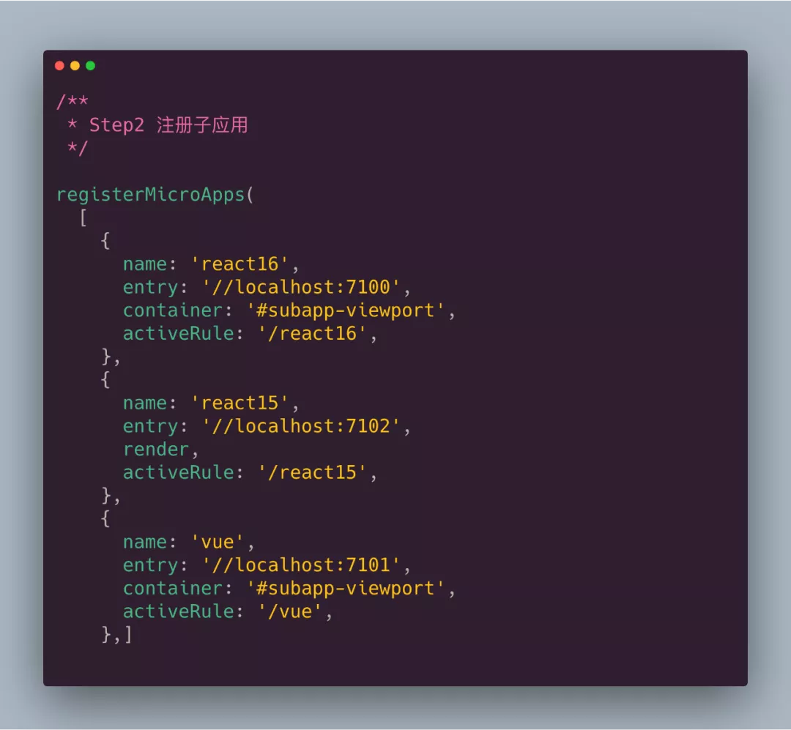
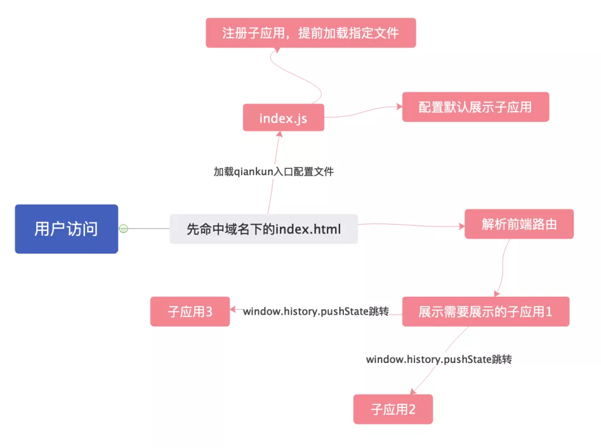
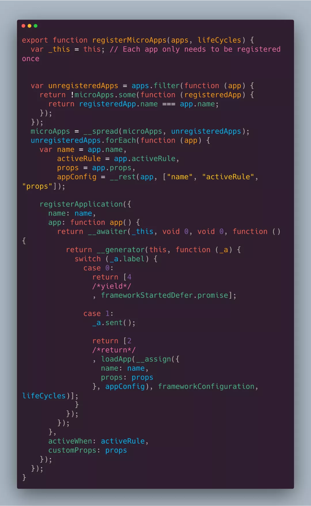

## 微前端框架是怎么导入加载子应用的

!> 微前端似乎是最近一个很火的话题，我们也即将使用在生产环境中，接下来会更新一系列微前端源码分析、手写微前端文章

废话不多说，直接参考目前的微前端框架注册子应用模块代码

下面代码，我指定的entry,就是子应用的访问入口地址

**微前端到底是怎么回事呢？**  

**那么registerMicroApps,到底做了什么呢**

源码解析下，只看重要部分今天：

`lifeCycles`是我们自己传入的生命周期函数（这里先不解释），跟react这种框架一样，微前端针对每个子应用，也封装了一些生命周期，如果你是小白，那我就用最简单的话告诉你，生命周期钩子，其实在框架源码就是一个函数编写调用顺序而已（有的分异步和同步）

`apps`就是我们传入的数组，子应用集合

代码里做了一些防重复注册、数据处理等

看源码，不要全部都看，那样很费时间，而且你也得不到利益最大化，只看最精髓、重要部分

无论上面做了上面子应用去重、数据处理，我只要盯着每个子应用，即app这个对象即可

看到了`loadApp`这个方法，我们可以大概猜测到，是通过这个方法加载

