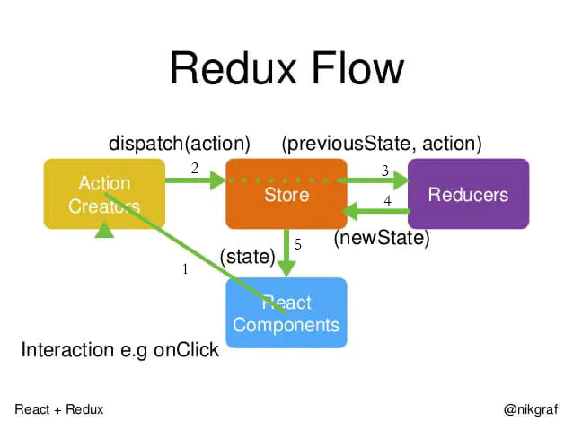

## Redux 使用流程与个人心得

?>Redux 是React生态中重要的组成部分。很多人都说，简单的应用可以不用此工具。但是我个人认为，中小型应用使用的话，可以使文件结构更加规范，代码可读性更强。因为React提出将展示组件与容器组件分离的思想，所以降低了React 与Redux之间的耦合度。

1. 核心

state：普通对象
action：JS 普通对象，用来描述发生了什么，store 数据的唯一来源
reducer：把 action 和 state 串起来。接收 state 和 action 作为参数，并返回新的 state 的函数。

2. 三大原则
单一数据源：只存在唯一一个store
state只读：唯一改变 state 的方法就是触发 action
使用纯函数进行修改：reducer
3. 主要组件

action

通过dispatch传递数据到store
reducer

描述如何响应action更新state
store

维持应用的 state；
提供 getState() 方法获取 state；
提供 dispatch(action) 方法更新 state；
通过 subscribe(listener) 注册监听器;
通过 subscribe(listener) 返回的函数注销监听器。

网上广为流传的Redux流向图，可以帮助我们更好地理解并使用。

我个人粗浅的理解是：
`Store`的角色是整个应用的数据存储中心，集中大部分页面需要的状态数据；
`ActionCreators` ,`view` 层与`data`层的介质；
`Reduce` ，接收`action`并更新`Store`。
所以流程是 用户通过界面组件 触发`ActionCreator`，携带`Store`中的旧`State`与`Action` 流向`Reducer`,`Reducer`返回新的`state`，并更新界面。

