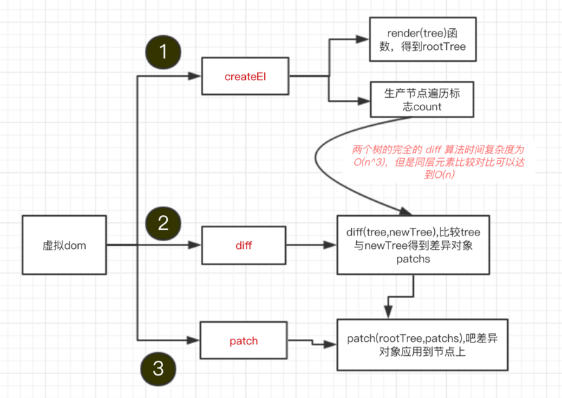
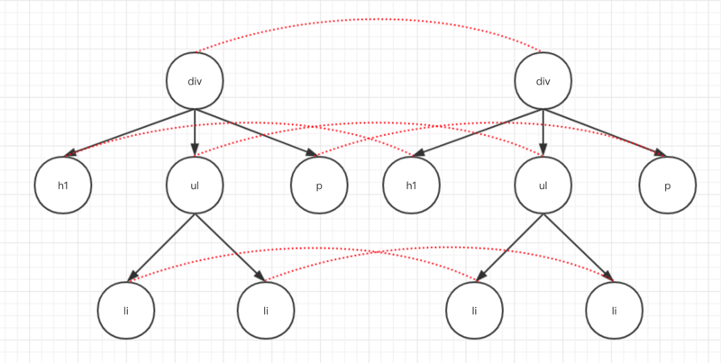
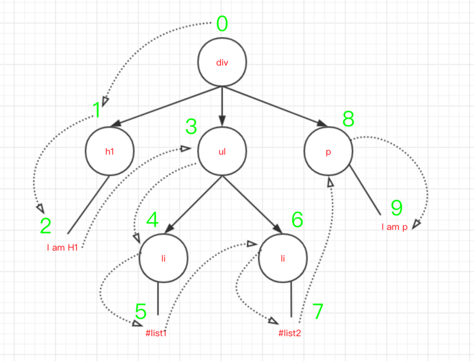

## 浅析虚拟dom原理并实现

### 背景
大家都知道，在网页中浏览器资源开销最大便是DOM节点了，DOM很慢并且非常庞大，网页性能问题大多数都是有JavaScript修改DOM所引起的。我们使用Javascript来操纵DOM，操作效率往往很低，由于DOM被表示为树结构，每次DOM中的某些内容都会发生变化，因此对DOM的更改非常快，但更改后的元素，并且它的子项必须经过Reflow / Layout阶段，然后浏览器必须重新绘制更改，这很慢的。因此，回流/重绘的次数越多，您的应用程序就越卡顿。但是，Javascript运行速度很快，虚拟DOM是放在JS 和 HTML中间的一个层。它可以通过新旧DOM的对比，来获取对比之后的差异对象，然后有针对性的把差异部分真正地渲染到页面上，从而减少实际DOM操作，最终达到性能优化的目的。

### 虚拟dom原理流程

简单概括有三点：

1. 用JavaScript模拟DOM树，并渲染这个DOM树
2. 比较新老DOM树，得到比较的差异对象
3. 把差异对象应用到渲染的DOM树。

下面是流程图：



下面我们用代码一步步去实现一个流程图

### 用JavaScript模拟DOM树并渲染到页面上

其实虚拟DOM，就是用JS对象结构的一种映射，下面我们一步步实现这个过程。

我们用JS很容易模拟一个DOM树的结构，例如用这样的一个函数`createEl(tagName, props, children)`来创建DOM结构。
> `tagName`标签名、`props`是属性的对象、`children`是子节点。

然后渲染到页面上，代码如下:
```js
const createEl = (tagName, props, children) => new CreactEl(tagName, props, children)

const vdom = createEl('div', { 'id': 'box' }, [
  createEl('h1', { style: 'color: pink' }, ['I am H1']),
  createEl('ul', {class: 'list'}, [createEl('li', ['#list1']), createEl('li', ['#list2'])]),
  createEl('p', ['I am p'])
])

const rootnode = vdom.render()
document.body.appendChild(rootnode) 
```

通过上面的函数，调用`vdom.render()`这样子我们就很好的构建了如下所示的一个DOM树，然后渲染到页面上

```js
<div id="box">
  <h1 style="color: pink;">I am H1</h1>
  <ul class="list">
    <li>#list1</li>
    <li>#list2</li>
  </ul>
  <p>I am p</p>
</div>
```
下面我们看看CreactEl.js代码流程：

```js
import { setAttr } from './utils'
class CreateEl {
  constructor (tagName, props, children) {
    // 当只有两个参数的时候 例如 celement(el, [123])
    if (Array.isArray(props)) {
      children = props
      props = {}
    }
    // tagName, props, children数据保存到this对象上
    this.tagName = tagName
    this.props = props || {}
    this.children = children || []
    this.key = props ? props.key : undefined

    let count = 0
    this.children.forEach(child => {
      if (child instanceof CreateEl) {
        count += child.count
      } else {
        child = '' + child
      }
      count++
    })
    // 给每一个节点设置一个count
    this.count = count
  }
  // 构建一个 dom 树
  render () {
    // 创建dom
    const el = document.createElement(this.tagName)
    const props = this.props
    // 循环所有属性，然后设置属性
    for (let [key, val] of Object.entries(props)) {
      setAttr(el, key, val)
    }
    this.children.forEach(child => {
      // 递归循环 构建tree
      let childEl = (child instanceof CreateEl) ? child.render() : document.createTextNode(child)
      el.appendChild(childEl)
    })
    return el
  }
}
```

上面`render`函数的功能是把节点创建好，然后设置节点属性，最后递归创建。这样子我们就得到一个DOM树，然后插入(appendChild)到页面上。

### 比较新老dom树，得到比较的差异对象

上面，我们已经创建了一个DOM树，然后在创建一个不同的DOM树，然后做比较，得到比较的差异对象。

比较两棵DOM树的差异，是虚拟DOM的最核心部分，这也是人们常说的虚拟DOM的diff算法，两颗完全的树差异比较一个时间复杂度为 O(n^3)。但是在我们的web中很少用到跨层级DOM树的比较，所以一个层级跟一个层级对比，这样算法复杂度就可以达到 O(n)。如下图



其实在代码中，我们会从根节点开始标志遍历，遍历的时候把每个节点的差异(包括文本不同，属性不同，节点不同)记录保存起来。如下图：



两个节点之间的差异有总结起来有下面4种

```html
0 直接替换原有节点
1 调整子节点，包括移动、删除等
2 修改节点属性
3 修改节点文本内容
```

如下面两棵树比较，把差异记录下来。

主要是简历一个遍历index（看图3），然后从根节点开始比较，比较万之后记录差异对象，继续从左子树比较，记录差异，一直遍历下去。主要流程如下

```js

// 这是比较两个树找到最小移动量的算法是Levenshtein距离，即O（n * m)
// 具体请看 https://www.npmjs.com/package/list-diff2
import listDiff from 'list-diff2'
// 比较两棵树
function diff (oldTree, newTree) {
  // 节点的遍历顺序
  let index = 0
  // 在遍历过程中记录节点的差异
  let patches = {}
  // 深度优先遍历两棵树
  deepTraversal(oldTree, newTree, index, patches)
  // 得到的差异对象返回出去
  return patches
}

function deepTraversal(oldNode, newNode, index, patches) {
  let currentPatch = []
  // ...中间有很多对patches的处理
  // 递归比较子节点是否相同
  diffChildren(oldNode.children, newNode.children, index, patches, currentPatch)
  if (currentPatch.length) {
    // 那个index节点的差异记录下来
    patches[index] = currentPatch
  }
}

// 子数的diff
function diffChildren (oldChildren, newChildren, index, patches, currentPatch) {
  const diffs = listDiff(oldChildren, newChildren)
  newChildren = diffs.children
  // ...省略记录差异对象
  let leftNode = null
  let currentNodeIndex = index
  oldChildren.forEach((child, i) => {
    const newChild = newChildren[i]
    // index相加
    currentNodeIndex = (leftNode && leftNode.count) ? currentNodeIndex + leftNode.count + 1 : currentNodeIndex + 1
    // 深度遍历，递归
    deepTraversal(child, newChild, currentNodeIndex, patches)
    // 从左树开始
    leftNode = child
  })
}
```
然后我们调用完diff(tree, newTree)等到最后的差异对象是这样子的。
```js
{
  "1": [
    {
      "type": 0,
      "node": {
        "tagName": "h3",
        "props": {
          "style": "color: green"
        },
        "children": [
          "I am H1"
        ],
        "count": 1
      }
    }
  ]
  ...
}
```
key是代表那个节点，这里我们是第二个，也就是h1会改变成h3.


然后看下diff.js的完整代码，如下
```js

import listDiff from 'list-diff2'
// 每个节点有四种变动
export const REPLACE = 0 // 替换原有节点
export const REORDER = 1 // 调整子节点，包括移动、删除等
export const PROPS = 2 // 修改节点属性
export const TEXT = 3 // 修改节点文本内容

export function diff (oldTree, newTree) {
  // 节点的遍历顺序
  let index = 0
  // 在遍历过程中记录节点的差异
  let patches = {}
  // 深度优先遍历两棵树
  deepTraversal(oldTree, newTree, index, patches)
  // 得到的差异对象返回出去
  return patches
}

function deepTraversal(oldNode, newNode, index, patches) {
  let currentPatch = []
  if (newNode === null) { // 如果新节点没有的话直接不用比较了
    return
  }
  if (typeof oldNode === 'string' && typeof newNode === 'string') {
    // 比较文本节点
    if (oldNode !== newNode) {
      currentPatch.push({
        type: TEXT,
        content: newNode
      })
    }
  } else if (oldNode.tagName === newNode.tagName && oldNode.key === newNode.key) {
    // 节点类型相同
    // 比较节点的属性是否相同
    let propasPatches = diffProps(oldNode, newNode)
    if (propasPatches) {
      currentPatch.push({
        type: PROPS,
        props: propsPatches
      })
    }
    // 递归比较子节点是否相同
    diffChildren(oldNode.children, newNode.children, index, patches, currentPatch)
  } else {
    // 节点不一样，直接替换
    currentPatch.push({ type: REPLACE, node: newNode })
  }

  if (currentPatch.length) {
    // 那个index节点的差异记录下来
    patches[index] = currentPatch
  }

}

// 子数的diff
function diffChildren (oldChildren, newChildren, index, patches, currentPatch) {
  var diffs = listDiff(oldChildren, newChildren)
  newChildren = diffs.children
  // 如果调整子节点，包括移动、删除等的话
  if (diffs.moves.length) {
    var reorderPatch = {
      type: REORDER,
      moves: diffs.moves
    }
    currentPatch.push(reorderPatch)
  }

  var leftNode = null
  var currentNodeIndex = index
  oldChildren.forEach((child, i) => {
    var newChild = newChildren[i]
    // index相加
    currentNodeIndex = (leftNode && leftNode.count) ? currentNodeIndex + leftNode.count + 1 : currentNodeIndex + 1
    // 深度遍历，从左树开始
    deepTraversal(child, newChild, currentNodeIndex, patches)
    // 从左树开始
    leftNode = child
  })
}

// 记录属性的差异
function diffProps (oldNode, newNode) {
  let count = 0 // 声明一个有没没有属性变更的标志
  const oldProps = oldNode.props
  const newProps = newNode.props
  const propsPatches = {}

  // 找出不同的属性
  for (let [key, val] of Object.entries(oldProps)) {
    // 新的不等于旧的
    if (newProps[key] !== val) {
      count++
      propsPatches[key] = newProps[key]
    }
  }
  // 找出新增的属性
  for (let [key, val] of Object.entries(newProps)) {
    if (!oldProps.hasOwnProperty(key)) {
      count++
      propsPatches[key] = val
    }
  }
  // 没有新增 也没有不同的属性 直接返回null
  if (count === 0) {
    return null
  }

  return propsPatches
}
```

得到差异对象之后，剩下就是把差异对象应用到我们的dom节点上面了。

### 把差异对象应用到渲染的dom树
到了这里其实就简单多了。我们上面得到的差异对象之后，然后选择同样的深度遍历，如果那个节点有差异的话，判断是上面4种中的哪一种，根据差异对象直接修改这个节点就可以了。
```js
function patch (node, patches) {
  // 也是从0开始
  const step = {
    index: 0
  }
  // 深度遍历
  deepTraversal(node, step, patches)
}

// 深度优先遍历dom结构
function deepTraversal(node, step, patches) {
  // 拿到当前差异对象
  const currentPatches = patches[step.index]
  const len = node.childNodes ? node.childNodes.length : 0
  for (let i = 0; i < len; i++) {
    const child = node.childNodes[i]
    step.index++
    deepTraversal(child, step, patches)
  }
  //如果当前节点存在差异
  if (currentPatches) {
    // 把差异对象应用到当前节点上
    applyPatches(node, currentPatches)
  }
}
```

这样子，调用patch(rootnode, patches)就直接有针对性的改变有差异的节点了。

path.js完整代码如下：

```js
import {REPLACE, REORDER, PROPS, TEXT} from './diff'
import { setAttr } from './utils'

export function patch (node, patches) {
  // 也是从0开始
  const step = {
    index: 0
  }
  // 深度遍历
  deepTraversal(node, step, patches)
}

// 深度优先遍历dom结构
function deepTraversal(node, step, patches) {
  // 拿到当前差异对象
  const currentPatches = patches[step.index]
  const len = node.childNodes ? node.childNodes.length : 0
  for (let i = 0; i < len; i++) {
    const child = node.childNodes[i]
    step.index++
    deepTraversal(child, step, patches)
  }
  //如果当前节点存在差异
  if (currentPatches) {
    // 把差异对象应用到当前节点上
    applyPatches(node, currentPatches)
  }
}

// 把差异对象应用到当前节点上
function applyPatches(node, currentPatches) {
  currentPatches.forEach(currentPatch => {
    switch (currentPatch.type) {
      // 0: 替换原有节点
      case REPLACE:
        var newNode = (typeof currentPatch.node === 'string') ?  document.createTextNode(currentPatch.node) : currentPatch.node.render()
        node.parentNode.replaceChild(newNode, node)
        break
      // 1: 调整子节点，包括移动、删除等
      case REORDER: 
        moveChildren(node, currentPatch.moves)
        break
      // 2: 修改节点属性
      case PROPS:
        for (let [key, val] of Object.entries(currentPatch.props)) {
          if (val === undefined) {
            node.removeAttribute(key)
          } else {
            setAttr(node, key, val)
          }
        }
        break;
      // 3：修改节点文本内容
      case TEXT:
        if (node.textContent) {
          node.textContent = currentPatch.content
        } else {
          node.nodeValue = currentPatch.content
        }
        break;
      default: 
        throw new Error('Unknow patch type ' + currentPatch.type);
    }
  })
}

// 调整子节点，包括移动、删除等
function moveChildren (node, moves) {
  let staticNodelist = Array.from(node.childNodes)
  const maps = {}
  staticNodelist.forEach(node => {
    if (node.nodeType === 1) {
      const key = node.getAttribute('key')
      if (key) {
        maps[key] = node
      }
    }
  })
  moves.forEach(move => {
    const index = move.index
    if (move.type === 0) { // 变动类型为删除的节点
      if (staticNodeList[index] === node.childNodes[index]) {
        node.removeChild(node.childNodes[index]);
      }
      staticNodeList.splice(index, 1);
    } else {
      let insertNode = maps[move.item.key] 
          ? maps[move.item.key] : (typeof move.item === 'object') 
          ? move.item.render() : document.createTextNode(move.item)
      staticNodelist.splice(index, 0, insertNode);
      node.insertBefore(insertNode, node.childNodes[index] || null)
    }
  })
}
```

?> 到这里，最基本的虚拟DOM原理已经讲完了，也简单了实现了一个虚拟DOM，如果本文有什么不对的地方请指正。